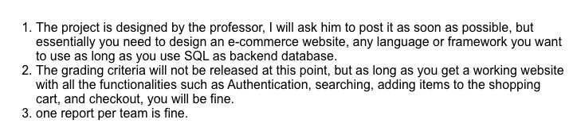

# INFSCI2710 数据库小组项目文档概要

## 排期

9.28 Project Assignment

10.3

1. 讨论需求，功能点，所需接口，数据库等
2. 详细分工
3. 开始编写接口文档
4. 设计数据库
5. 定义枚举值
    - 商品大类，小类
    - 权限点
    - 用户角色
    - 用户状态
    - 用户标签
    - 用户年级
6. 开始学习！！！！

10.9 (需求文档交付)

1. 同步学习进度
2. 开始页面设计
3. 需求文档交付(按开发周期分批次)

10.16 (期中考完)

1. 开始项目架构（前后端并行）
2. 完善文档，并实时调整需求、排期
3. 数据库设计交付，修改完善接口文档
4. 设计初步交付

10.20 (期中考完) (接口文档、设计、架构交付)

1. 设计交付
2. 接口文档交付
3. 架构交付
4. 正式开始开发！！！！！
5. 每周二周六两次小会同步进度，汇总问题

10.30

1. 首批需求合并
2. 解决问题，讨论第二期需求

11.9

1. 末批需求合并
2. 找出残留问题，讨论问题
3. bugfix

11.13

1. 最后一次合并
2. 不更新需求、功能的前提上修改bug并上线

11.20

1. 完成项目上线，开始report

11.30

1. deadline

## 9.28汇总

1. 有序
2. 有参与感
3. 有干货

* 团队开发方式
  1. 工具: github，共两个项目，分前后端
  2. 共享文档: md文档

* 文档
  1. 文档内容统一放在后段项目文件中，文档主要包括: 会议文档、
  需求文档、
  页面设计文档、数据库设计文档、接口文档、
  
  技术评审与bugfix文档 共7份
  2. 简介各文档作用

* 网页形式、功能简要构思

* 技术选型  java springboot

* 初步排期

身份认证
搜索
添加物品
购物车
支付

## 需求文档
